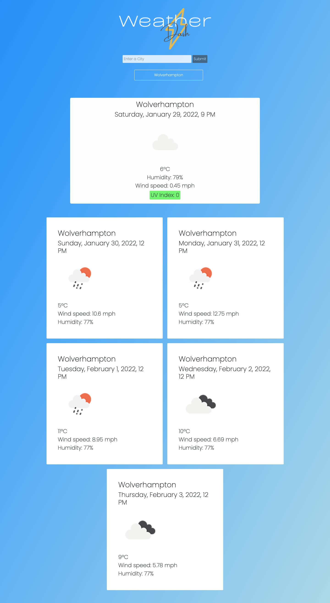

# Weather-Dashboard

This application serves as a weather dashboard, that allows the user to input a city name and view the current weather for that city, which details the city name, date, time, temperature, windspeed, humidity and uv index. The user can also view weather data for the coming 5 days in their chosen city.
User input will be saved to local storage, and made accessible to the user in a search history format, which means they can simply click on a button of a previously searched city, to view the current data for that city.

https://laurawalters1.github.io/Weather-Dashboard/

https://github.com/laurawalters1/Weather-Dashboard
